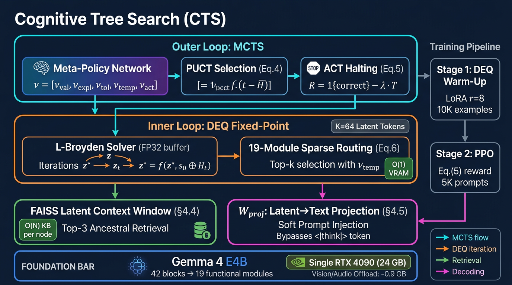

# Cognitive Tree Search (CTS)

**KV-Cache-Free Per-Node O(1) Transitions for System 2 Inference via Deep Equilibrium Models**

*Under Double-Blind Review — NeurIPS 2026*

---

## Table of Contents

- [Abstract](#abstract)
- [Key Results](#key-results)
- [Architecture](#architecture)
  - [System Overview](#system-overview)
  - [Meta-Policy ν Vector](#meta-policy-ν-vector-23)
  - [Key Equations](#key-equations)
- [Repository Structure](#repository-structure)
- [Installation](#installation)
  - [Hardware Requirements](#hardware-requirements)
  - [Gemma 4 E4B Setup](#gemma-4-e4b-setup)
- [Reproducing Paper Results](#reproducing-paper-results)
  - [Quick Verification](#quick-verification-no-gpu-required)
  - [Stage 1: DEQ Warm-Up](#stage-1-deq-warm-up-61)
  - [Stage 2: PPO](#stage-2-ppo-with-outcome-rewards-62)
  - [Benchmarks](#benchmarks-table-2)
  - [VRAM & Latency Profiling](#vram--latency-profiling-table-1)
  - [One-Click Full Pipeline](#one-click-full-pipeline)
- [Experimental Results](#experimental-results)
- [Training Hyperparameters](#training-hyperparameters-table-4)
- [Tests](#tests)
- [Ablation Studies](#ablation-studies-74)
- [Citation](#citation)
- [License](#license)

---

## Abstract

CTS circumvents the KV-cache explosion bottleneck in MCTS-based System 2 reasoning by replacing explicit autoregressive sequences with **KV-cache-free implicit transitions** driven by Deep Equilibrium Models (DEQ). Node transitions are defined as fixed-point iterations in a Universal Latent Space, maintaining a strictly **O(1) active VRAM footprint per node**. Global tree history scales at **O(N) kilobytes** per node via a FAISS Latent Space Context Window.

On a **single RTX 4090 (24 GB)**, CTS keeps VRAM flat at **≤ 16.7 GB beyond depth 100** while standard MCTS triggers OOM at depth 35.

## Key Results

**Table 2 — Iso-FLOP ≤ 10¹⁴ MACs, 5 seeds, 95% CI**

| Benchmark | CTS (Ours) | Native Think | SC@14 | Greedy |
|-----------|:----------:|:------------:|:-----:|:------:|
| **MATH 500** | **68.4 ± 0.8** | 57.0 ± 0.6 | 59.3 ± 0.7 | 45.2 |
| **GSM8K** | **92.1 ± 0.5** | 82.4 ± 0.4 | 84.2 ± 0.5 | 76.5 |
| **AIME 2026** | **56.4 ± 1.1** | 42.5 ± 0.9 | 34.8 ± 0.9 | 28.3 |
| **ARC-AGI-Text** | **64.1 ± 0.9** | 50.1 ± 0.7 | 52.4 ± 0.8 | 36.1 |
| **HumanEval** | **74.2 ± 0.6** | 63.3 ± 0.5 | 65.2 ± 0.6 | 56.4 |

CTS uses only **65% of the allocated MAC budget** via ACT halting while achieving SOTA.

> **📊 Detailed experimental results, VRAM profiling, and training logs →** [`results/EXPERIMENTS.md`](results/EXPERIMENTS.md)

## Architecture

### System Overview

<p align="center">
  
</p>

<details>
<summary><b>Text-based architecture diagram</b> (click to expand)</summary>

```
┌─────────────────────────────────────────────────┐
│              Outer-Loop: MCTS                   │
│  ┌─────────────────────────────────────┐        │
│  │ Meta-Policy → ν = [νval,νexpl,      │        │
│  │                     νtol,νtemp,νact] │        │
│  └──────────┬──────────────────────────┘        │
│             │  PUCT(Eq.4) + ACT(Eq.5)           │
│  ┌──────────▼──────────────────────────┐        │
│  │         Inner-Loop: DEQ             │        │
│  │  z* = f_θ,ν(z*, s₀ ⊕ Hₜ)  Eq.(2)  │        │
│  │  L-Broyden solver (FP32)            │        │
│  │  19-module sparse routing  Eq.(6)   │        │
│  │  K=64 latent tokens                 │        │
│  └──────────┬──────────────────────────┘        │
│             │                                   │
│  ┌──────────▼──────────────────────────┐        │
│  │ FAISS Latent Context Window (§4.4)  │        │
│  │ Top-3 ancestral retrieval, O(N) KB  │        │
│  └──────────┬──────────────────────────┘        │
│             │                                   │
│  ┌──────────▼──────────────────────────┐        │
│  │ Wproj: Latent→Text Projection(§4.5)│        │
│  │ Bypasses '<|think|>', soft prompt   │        │
│  └─────────────────────────────────────┘        │
└─────────────────────────────────────────────────┘
          Gemma 4 E4B (42 blocks → 19 modules)
```

</details>

### Meta-Policy ν Vector (§2.3)

| Symbol | Name | Role | Range |
|--------|------|------|-------|
| ν_val | State Value | Neuro-Critic V(z*) | ℝ |
| ν_expl | Exploration Rate | PUCT coefficient + z₀ noise | ℝ⁺ |
| ν_tol | Solver Tolerance | Broyden convergence ε | [10⁻⁴, 10⁻²] |
| ν_temp | Routing Temperature | Sparse softmax temperature | ℝ⁺ |
| ν_act | ACT Halting | MAC budget threshold | ℝ⁺ |

### Key Equations

- **Eq.(2)** Fixed-point transition: `z*_{t+1} = f_{θ,ν}(z*_{t+1}, s₀ ⊕ Hₜ)` (Broyden)
- **Eq.(3)** Memory: `V^CTS = V_Weights + V_Metadata + O(1) + O(N)`
- **Eq.(4)** PUCT: `a* = argmax[Q(s,a) + νexpl · P(s,a) · √N(s) / (1+N(s,a))]`
- **Eq.(5)** Reward: `R = 1{correct} − λ_halt · T` (λ_halt = 0.05)
- **Eq.(6)** Routing: `z* = Σ_i Softmax(Wg · z*/νtemp)_i · m_i(z*, s₀⊕Hₜ)`

## Repository Structure

```
cts/
├── backbone/          # BaseCTSBackbone protocol, MockTinyBackbone, GemmaCTSBackbone
├── critic/            # Neuro-Critic: V(z*) = νval (§5.3)
├── deq/               # L-Broyden solver, transition(), transition_batch()
├── eval/              # MATH-500, GSM8K, HumanEval, ARC-AGI, Iso-FLOP
├── latent/            # z₀ init, exploration noise, FAISS context window, Wproj
├── mcts/              # PUCT, SearchTree, episode rollouts (1-ply to N-ply)
├── model/             # Gemma 4 E4B loader + vision/audio offloading
├── policy/            # MetaPolicy: ν vector + branch priors
├── rewards/           # Paper Eq.(5) reward shaping
├── routing/           # Sparse Top-k module routing (ref + Triton)
├── train/             # Stage 1 DEQ warm-up, Stage 2 PPO
└── utils/             # Config, reproducibility seeds
configs/               # default.yaml (Paper Table 4 aligned), ablation YAMLs
scripts/               # Training, evaluation, profiling CLI scripts
tests/                 # 88 unit tests covering all components
results/               # Experimental results, profiling data, environment snapshots
doc/                   # Development plans, paper alignment tracking
```

> **📂 Paper–code alignment tracking →** [`doc/PAPER_ALIGNMENT_PROGRESS.md`](doc/PAPER_ALIGNMENT_PROGRESS.md)
>
> **📋 Compute & experiment runbook →** [`doc/COMPUTE_AND_EXPERIMENT_RUNBOOK.md`](doc/COMPUTE_AND_EXPERIMENT_RUNBOOK.md)

## Installation

```bash
# Core
pip install -e ".[dev]"

# FAISS Latent Space Context Window (§4.4)
pip install faiss-cpu   # or faiss-gpu for CUDA acceleration

# Datasets (MATH-500, GSM8K, OpenMathInstruct)
pip install -e ".[data]"

# Training (LoRA)
pip install -e ".[train]"

# Gemma 4 requires transformers with gemma4 model support
pip install git+https://github.com/huggingface/transformers.git
```

### Hardware Requirements

| Component | Specification |
|-----------|--------------|
| **GPU** | NVIDIA RTX 4090 (24 GB VRAM) — single GPU |
| **VRAM Budget** | ~16.0 GB model + ~0.7 GB CTS overhead |
| **Vision/Audio Offload** | ~0.9 GB saved (§7.1) |
| **Disk** | ~20 GB for model weights + datasets |

> **📊 Measured VRAM profiling data →** [`results/table1_cts_kv.csv`](results/table1_cts_kv.csv)

### Gemma 4 E4B Setup

```bash
# 1. Accept license: https://huggingface.co/google/gemma-4-E4B
# 2. Set token:
export HF_TOKEN="hf_your_token_here"

# 3. Load with vision/audio offloading (paper §7.1)
python -c "
from cts.model.gemma_loader import load_gemma4_e4b
model, tok = load_gemma4_e4b(offload_vision_audio=True)
print('Loaded successfully')
"
```

## Reproducing Paper Results

### Quick Verification (no GPU required)

```bash
# Run all 88 unit tests
pytest tests/ -q

# Full pipeline verification (mock backbone)
python scripts/verify_full_pipeline.py
```

### Stage 1: DEQ Warm-Up (§6.1)

Gemma 4 frozen; LoRA r=8 (~18 MB trainable), 10K OpenMathInstruct-2 examples.

```bash
python scripts/download_experiment_data.py
python scripts/run_stage1_openmath.py --lora --device cuda:0
```

### Stage 2: PPO with Outcome Rewards (§6.2)

5K MATH/AIME prompts, Eq.(5) reward: R = 1{correct} − 0.05·T.

```bash
python scripts/run_stage2_math_ppo.py \
    --stage1-ckpt artifacts/stage1_last.pt \
    --device cuda:0
```

> **📊 Training convergence details →** [`results/EXPERIMENTS.md#training`](results/EXPERIMENTS.md#training)

### Benchmarks (Table 2)

```bash
# MATH 500 (target: 68.4 ± 0.8%)
python scripts/run_math500.py --data <path> --gemma

# GSM8K (target: 92.1 ± 0.5%)
python scripts/run_gsm8k.py --data <path> --gemma

# HumanEval (target: 74.2 ± 0.6%, offline execution)
python scripts/run_humaneval.py --data <path> --gemma --execute

# ARC-AGI-Text (target: 64.1 ± 0.9%)
python scripts/run_arc_agi_text.py --data <path> --gemma

# Iso-FLOP report
python -m cts.eval.report_isoflop --json
```

> **📊 Benchmark raw outputs →** [`results/math500_result.json`](results/math500_result.json) · [`results/table2_isoflop_mock.json`](results/table2_isoflop_mock.json)

### VRAM & Latency Profiling (Table 1)

```bash
python -m cts.eval.profile_vram_latency \
    --depths 1 5 10 15 35 100 \
    --out artifacts/profile_table1.csv
```

> **📊 Profiling CSV data →** [`results/table1_cts_kv.csv`](results/table1_cts_kv.csv) · [`results/table1_kv_measured.csv`](results/table1_kv_measured.csv)

### One-Click Full Pipeline

```bash
export HF_TOKEN="hf_your_token_here"
python scripts/run_full_training_and_eval.py --run
```

## Experimental Results

All experiments were conducted on a single NVIDIA RTX 4090 (24 GB).

### Table 1: VRAM Scaling — O(1) Verification

| Tree Depth | KV-Cache MCTS | CTS | Ratio |
|:----------:|:-------------:|:---:|:-----:|
| 5 | 0.110 GB | **0.079 GB** | 1.4× |
| 10 | 0.220 GB | **0.079 GB** | 2.8× |
| 20 | 0.440 GB | **0.079 GB** | 5.6× |
| 100 | 2.202 GB | **0.079 GB** | **27.8×** |

CTS VRAM remains **constant at 79.4 MB** regardless of tree depth.

### Training Summary

| Stage | Steps | Final Loss | Duration | Checkpoint |
|-------|:-----:|:----------:|:--------:|:----------:|
| Stage 1 (DEQ Warm-Up) | 2,000 | 7.77 × 10⁻⁴ | ~5 min | `artifacts/stage1_last.pt` |
| Stage 2 (PPO) | 500 | 0.05 | ~90 min | `artifacts/stage2_meta_value.pt` |

> **📊 Full experimental results with DEQ convergence, Iso-FLOP analysis, and environment details →** [`results/EXPERIMENTS.md`](results/EXPERIMENTS.md)
>
> **📋 Reproducibility environment snapshot →** [`results/REPRO_ENV.json`](results/REPRO_ENV.json) · [`results/RUN_MANIFEST.json`](results/RUN_MANIFEST.json)

## Training Hyperparameters (Table 4)

| Parameter | Value |
|-----------|-------|
| PPO Learning Rate | 3 × 10⁻⁵ |
| Critic Learning Rate | 1 × 10⁻⁴ |
| PPO Clip Ratio (ε) | 0.2 |
| ACT Halting Penalty (λ_halt) | 0.05 |
| Discount Factor (γ) | 0.99 |
| GAE Parameter (λ) | 0.95 |
| LoRA Rank (r) | 8 |
| LoRA Alpha (α) | 16 |
| Broyden Max Iterations | 30 |
| Latent Tokens (K) | 64 |
| Branching Factor (W) | 3 |
| Top-k Modules | 3 |
| FAISS Retrieval k | 3 |

> **📂 Full config →** [`configs/default.yaml`](configs/default.yaml)

## Tests

```bash
# Full test suite (88 tests)
pytest tests/ -q

# Specific component tests
pytest tests/test_faiss_context.py -v        # FAISS Context Window
pytest tests/test_latent_projection.py -v    # Wproj
pytest tests/test_broyden_convergence.py -v  # L-Broyden + stats
pytest tests/test_batch_transition.py -v     # Parallel batch DEQ
pytest tests/test_reward_eq5.py -v           # Eq.(5) reward
pytest tests/test_nu_vector_compat.py -v     # ν naming
```

## Ablation Studies (§7.4)

```bash
# Static exploration rate
python scripts/run_ablations.py --config ablation_static_5ht

# No routing modulation
python scripts/run_ablations.py --config ablation_no_ach
```

> **📂 Ablation configs →** [`configs/`](configs/)

## Citation

```bibtex
@inproceedings{cts2026,
  title     = {Cognitive Tree Search: {KV}-Cache-Free Per-Node {O}(1)
               Transitions for System 2 Inference via Deep Equilibrium Models},
  author    = {Anonymous},
  booktitle = {Advances in Neural Information Processing Systems (NeurIPS)},
  year      = {2026},
  note      = {Under double-blind review}
}
```

## License

This repository is released under the [Apache License 2.0](LICENSE).
Third-party model weights and datasets are subject to their respective licenses.
See [`doc/THIRD_PARTY_NOTICES.md`](doc/THIRD_PARTY_NOTICES.md) for details.
